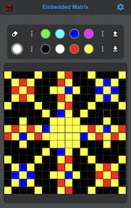
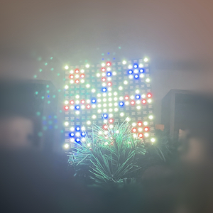
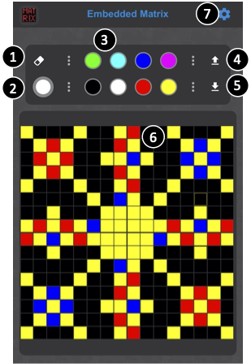
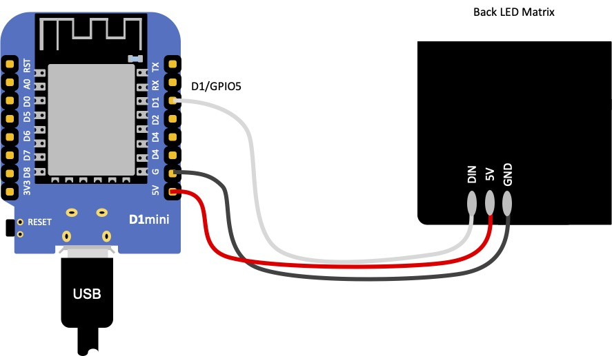
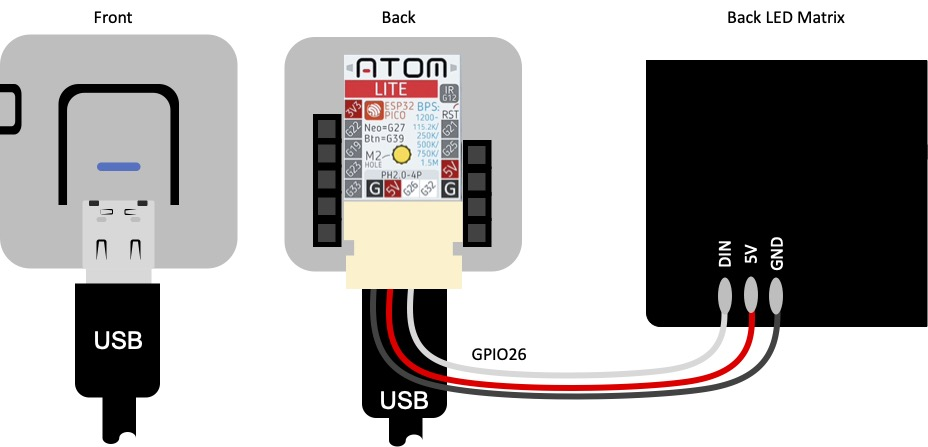

# ESP LED Matrix

ESP8266 / ESP32 driving an LED Matrix Module (16x16) with running the editor in the webbrowser, hosted by the ESP

  

## Usage

As soon ESP is booted the first time, a Wifi AP is generated:
```
Wifi AP:  EspLedMatrix
Password: EspLedMatrix
```

The Web-UI can be launched by navigating to `http://esp-led-matrix.local` or `http://192.168.4.1`. 

 

- 1: Erase all content
- 2: Choose color / display of current drawing color
- 3: Predefined colors
- 4: Upload an image
- 5: Download the current drawn image
- 6: Draw with a mouse or touch in your web-browser
- 7: Configure connect to existing WiFi AP / GPIO settings


## Firmware Installation

The firmware can be installed via the esptool utility. There are two different releade binaries existing:
- vX.X_esp32_esp-led-matrix.bin for ESP32
- vX.X_esp8266_esp-led-matrix.bin for ESP8266 or ESP8285

The esptool can be installed via pip:
```python3 -m pip install esptool```

To programm an ESP8266 or EPS8285, following command can be issued:
(for firmware version v1.0, COM-Port /dev/tty.SLAB_USBtoUART)
```
python3 -m esptool --port /dev/tty.SLAB_USBtoUART \
--baud 115200 \
write_flash 0x0 \
v1.0_esp8266_esp-led-matrix.bin
```

To programm an ESP32, following command can be issued:
(for firmware version v1.0, COM-Port /dev/tty.SLAB_USBtoUART)
```
python3 -m esptool --port /dev/tty.SLAB_USBtoUART \
--baud 115200 \
write_flash -z 0x1000 \
v1.0_esp32_esp-led-matrix.bin
```

## Hardware connection - D1Mini - ESP8266


## Hardware connection - ATOMLite - ESP32

